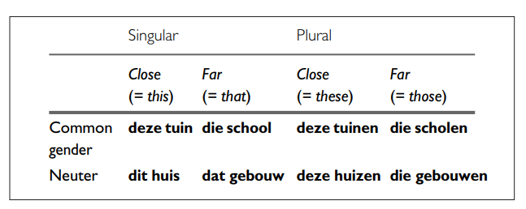

# Demonstratives `die` `deze` `dit` `dat`




## `deze` / `dit`

Dutch also distinguishes between `de`-words and `het`-words with demonstratives.

### `de`-words → `deze`

```text
deze auto
deze tafel
deze man
```

### `het`-words → `dit`

```text
dit huis
dit boek
dit kind
```

Compare:

```text
deze auto
dit huis
```

For plural nouns, use `deze`:

```text
deze auto's
deze huizen
deze boeken
```

So:

```text
singular de-word → deze
singular het-word → dit
plural → deze
```

---

## `die` / `dat`

The same distinction appears with `die` and `dat`.

### `de`-words → `die`

```text
die man
die vrouw
die auto
```

### `het`-words → `dat`

```text
dat huis
dat boek
dat kind
```

Plural → `die`:

```text
die huizen
die boeken
die auto's
```

The pattern is:

|            | Singular | Plural  |
| ---------- | -------- | ------- |
| `de`-word  | **die**  | **die** |
| `het`-word | **dat**  | **die** |

---

##  Useful rules for identifying `het`-words

There is no perfect rule, but several patterns are useful.

## Diminutives

Always `het`:

```text
het meisje
het hondje
het huisje
het boekje
```

## Infinitives used as nouns

Usually `het`:

```text
het eten
het drinken
het zwemmen
het werken
```

Examples:

```text
Het eten is lekker.
Het zwemmen is gezond.
```

## Languages

Usually `het`:

```text
het Nederlands
het Engels
het Duits
```

## Metals

Many names of metals use `het`:

```text
het goud
het zilver
het ijzer
```

These are useful patterns, but they are **not a substitute for learning the article with each noun**.

## A useful learning strategy

When learning Dutch vocabulary, don't learn only the English translation.

Instead of:

```text
huis = house
boek = book
tafel = table
```

learn:

```text
het huis = house
het boek = book
de tafel = table
```

An even better approach is to learn the noun in a short phrase:

```text
het grote huis
een groot huis

de grote tafel
een grote tafel
```

This lets you learn **the noun + article + adjective pattern** together.


