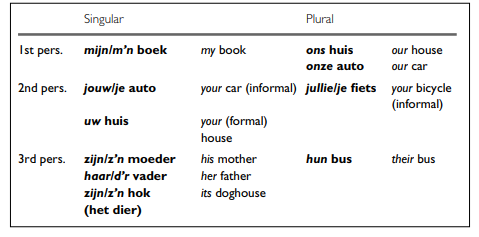
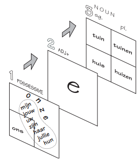

# Possession

## Possessive adjectives

Possessive words such as:




are used differently from `de` and `het`.

For example:

```text
mijn huis
mijn auto
mijn boek
```

However, **`ons` and `onze`** depend on whether the noun is a `het`-word or a `de`-word.

### `het`-word → `ons`

```text
ons huis
ons boek
ons kind
```

### `de`-word → `onze`

```text
onze auto
onze tafel
onze kinderen
```

This gives another reason why knowing whether a noun is a `de`- or `het`-word is important.

### Possessive adjective ending `-e`

> The possessive is not considered indefinite. So
a neuter singular noun preceded by a possessive has a modifying adjective
with an ending.


**Mijn hel<span style="color:red">**e**</span> gezin**.

**Haar nieuw<span style="color:red">**e**</span> huis**. Her new house.

**Ons klein<span style="color:red">**e**</span> land**. Our small country.

**Onze klein<span style="color:red">**e**</span> stad**. Our small town.




## Independent Possessive pronouns

| Person | Possessive determiner | Independent possessive pronoun | Example                                                   |
| ------ | --------------------- | ------------------------------ | --------------------------------------------------------- |
| ik     | mijn                  | **de mijne**                   | Mijn auto is sneller dan **de mijne**.                    |
| jij    | jouw                  | **de jouwe**                   | Is dit jouw fiets of **de jouwe**?                        |
| hij    | zijn                  | **de zijne**                   | Mijn telefoon is nieuwer dan **de zijne**.                |
| zij    | haar                  | **de hare**                    | Mijn tas is groter dan **de hare**.                       |
| het    | zijn                  | **de zijne**                   |                                                           |
| wij    | ons/onze              | **de onze**                    | Ons huis is groter dan **het onze**.                      |
| jullie | jullie                | **de jullie**                  | Dit is jullie probleem, niet **het probleem van jullie**. |
| zij    | hun                   | **de hunne**                   | Onze kinderen spelen met **de hunne**.                    |


> there is no distinguishment betweed `het` and `de` worden for `ons` `onze`

**Mijn huis is groot → Het mijne is groot.**

**Ons appartement is klein → Het <span style="color:red">**onze**</span> is klein.**

So the form is commonly:

> de/het + mijne/jouwe/zijne/hare/onze/hunne

These forms are relatively formal/literary. In everyday Dutch, `van mij`, `van jou`, etc. are <u>often more natural</u>:

**Dit is de mijne.** → correct, somewhat formal

**Dit is van mij.** → very natural

**Is dit de jouwe?** → correct

**Is dit van jou?** → very natural 

