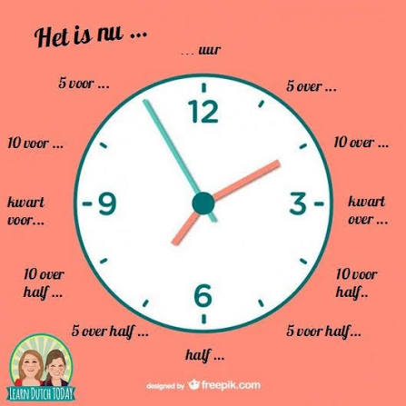

# Time

**Hoe laat is het?** -> **Het is twee uur**

## Preposition `om`

**Hoe laat vertrek jij?** -> **Om twaalf uur**

**Het is kwart over drie** (3:15)

**Wij gaan om kwart voor vijf.** (4:45)

**Het is vijf over half zes.** (5:35)

**Hij gaat om tien over half tien.** (9:40)

**Jij eet elke dag om vijf voor half zeven.** (6:25)

**Ik kom je om tien voor half acht halen.** (7:20)

**Het is half twee.** (1:30)

**De trein komt om half twaalf aan** (11:30)

## Preporitions of time

* `tegen` towards, by

**Hij komt tegen zeven uur** _He will come by seven o'clock_

* `omstreeks` `rond` around

**Zij vertrekt met de bus omstreeks/rond vijf over zeven.** _She leaves by bus around 7.05._

* `voor` before

**Kan je voor tien uur komen?** _Can you come before ten o’clock?_

* `na` after

**Na vijf minuten viel hij in slaap.** _He fell asleep after five minutes._

