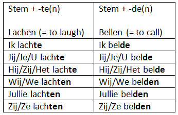
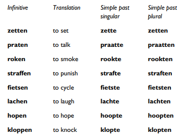
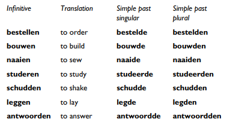
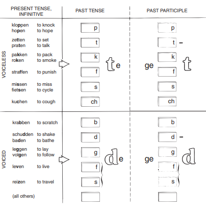
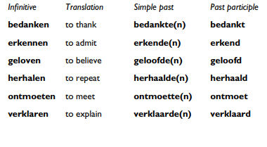

# Past tense: "weak" verbs

## Weak and strong verbs

* **WEAK**: the past tense is formed by the addition of a <u>suffix to the stem</u>
* **STRONG**:  the past tense is formed by a <u>vowel change</u> in the stem itself

|        | Present | Past                                         | Perfectum        |
|--------|---------|----------------------------------------------|------------------|
| WEAK   | wonen   | woond**e(n)** | (heeft) gewoond  |
| STRONG | zingen  | z**o**ng      | (heeft) gezongen |

## Simple past of weak verbs

> _Simple past_ = **stem** + **t/d** + **e(n)** 

### The TD rule

* The endings `-te`, `-ten` are used after voiceless consonants (`t`, `k`, `f`, `s`, `ch`, `p`). 

A handy way to remember them is with the word from a name for an old type of sailing vessel:

> **’t kofschip**

Notice that since `-tt-` is a spelling convention and pronounced like
single `t`, and `-n` is dropped in ordinary speech, **praten** (infinitive),
**praatte** (simple past, singular), **praatten** (simple past plural) are all
pronounced alike.

*  Verbs that do not have any of the above consonants in their infinitive take a `-de`/`-den` ending:

## The past participle

> _Past participle_ = **ge** + **stem** + **t/d**

### Ending rule

* The `-t` ending is used when the final consonant of the stem is any of
the consonants in **’t kofschip**, provided it is the same consonant in the
infinitive.

* The `-d` ending is used for all other weak verbs

### Pronunciation notes

* In pronunciation there is no difference between `-t` and `-d` at the end of the word.

* Since doubled letters may never stand at the end of a word in Dutch,
no `-t` or `-d` is added to verbs whose stems already end in `-t` or `-d`:
  * **praten** -> ****ge**praa**t** hebben**
  * **antwoorden** -> ****ge**antwoor**d** hebben**

### No `ge-` for unstressed starting verbes

Dutch has six unstressed verbal prefixes, 
* `be-`: **bedanken -> bedankte(n) ->  bedankt**
* `er-` (only two verbs): **erkennen** (admit) -> **erkende(n)** -> **erkend**; **ervaren** (experience)
* `ge-`: **geloven** (believe) -> **geloofde(n)** -> **geloofd**
* `her-` (always adds a meaning of “again” to the verb): **herbouwen** (rebuild) -> **herbowde(n)** -> **herbowd**; **heralen** (repeat) -> **hearaalde(n)** -> **heraald**  
* `ont-`: **ontmoeten** (meet) -> **ontmoette(n)** -> **ontmoet** (never double consonants at the end)
* `ver-`: **verklaren** (declare) -> **verklaarde(n)** -> **verklaard**

>The participle prefix `ge-` is not added to verbs that already have one
of these six prefixes

P106